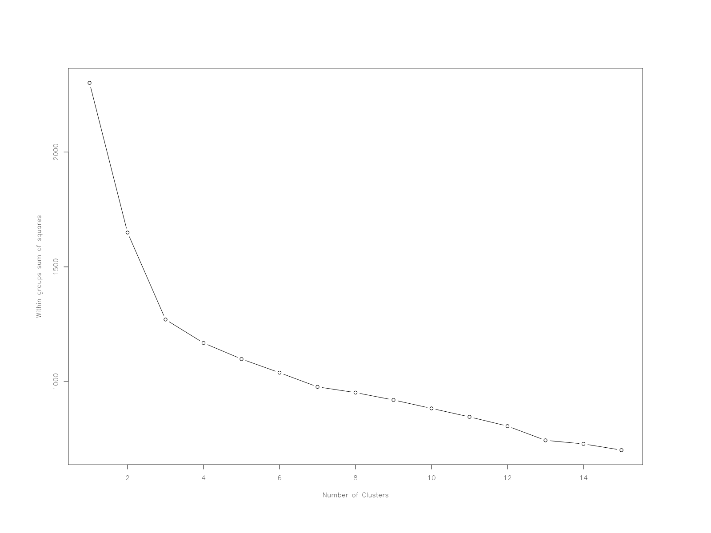

# K-means Clustering - exercise

_student work in R_

This exercise is adapted from the book [R in Action](http://www.r-bloggers.com/k-means-clustering-from-r-in-action/) and takes a look at a `wine` dataset.

## Load and Scale


``` r
install.packages(c("cluster", "rattle", "NbClust"))
library(cluster)
library(rattle)
library(NbClust)

data(wine, package = "rattle")
head(wine)
```


First off we'll remove the first column of and then normalizing the data using `scale()`. This method takes the mean and standard deviation of each value and then normalizes each values by substrating the mean and dividing by the standard deviation - I believe essentially creating a z-statistic. 

``` r
wine$Type <- NULL
winescale <- as.data.frame(round(scale(wine), digits = 4))
```

## Selecting a Number of Clusters

###### Method 01

_Looking for an elbow:_ 

"A plot of the total within-groups sums of squares against the number of clusters in a K-means solution can be helpful. A bend in the graph can suggest the appropriate amount of clusters."



_Questions:_

**How many clusters does this method suggest?**

My initial thought is that it would suggest 3-5 clusters - but much closer to 3. It feels like 5 if I strain. I'm looking at the 'joints' or 'elbows' of the plot - distinct changes in value, forming into a feature until the next 'bend' in the graph. My thinking is that clusters would form where there's an interval of points that exhibits something resembling a linear relationship - until it reaches the next 'elbow'. 

**Why does this method work? What is the intuition behind it?**

The _sum of squares within_ is the _distance of each sample_ from _it's groups' mean._ Group in this case is a column, with each value being a member. With the `wine` data, groups would be `Alcohol`, `Color`, `Diluation`, and such. The SSW is found by:

		0. calculate the mean of the group.
		1. find the difference between each sample and the mean of it's group.
		2. square each of these differences.
		3. take the sum of these squares.

So it's the _sum of squared differences_ between _each sample_ and _the mean of it's group._ 

The larger the value for the WSS, the larger the distance would be between each element and it's group's mean. The smaller the WSS, the closer each point would be to it's groups' mean. 

**Look at the code for wssplot() and figure out how it works.**

``` r
wssplot <- function(data, nc=15, seed=1234){
	              wss <- (nrow(data)-1)*sum(apply(data,2,var))
               	      for (i in 2:nc){
		        set.seed(seed)
	                wss[i] <- sum(kmeans(data, centers=i)$withinss)}
	                
		      plot(1:nc, wss, type="b", xlab="Number of Clusters",
	                        ylab="Within groups sum of squares")
	   }

par(mar = c(8, 8, 8, 8), family = "HersheySans")
wssplot(winescale)
```

It looks like `wssplot()` takes data as input, has a number of clusters set to 15, and sets the random seed at 1234. It then creates a variable to store the _sum of squares within_, and performs the calculation

		(number of rows minus 1) times (the sum of variance of each element by column)


###### Method 02

This method uses the function `NbClust()` to analyze criteria, and returns a distribution of the potential number of clusters. 

``` r
library(NbClust)
set.seed(1234)
nc <- NbClust(winescale, min.nc = 2, max.nc = 15, method = "kmeans")
barplot(table(nc$Best.n[1,]),
				xlab = "Number of Clusters", ylab = "Number of Criteria",
				main = "Number of Clusters Chosen by 26 Criteria")
```

**How many clusters does this method suggest?**


