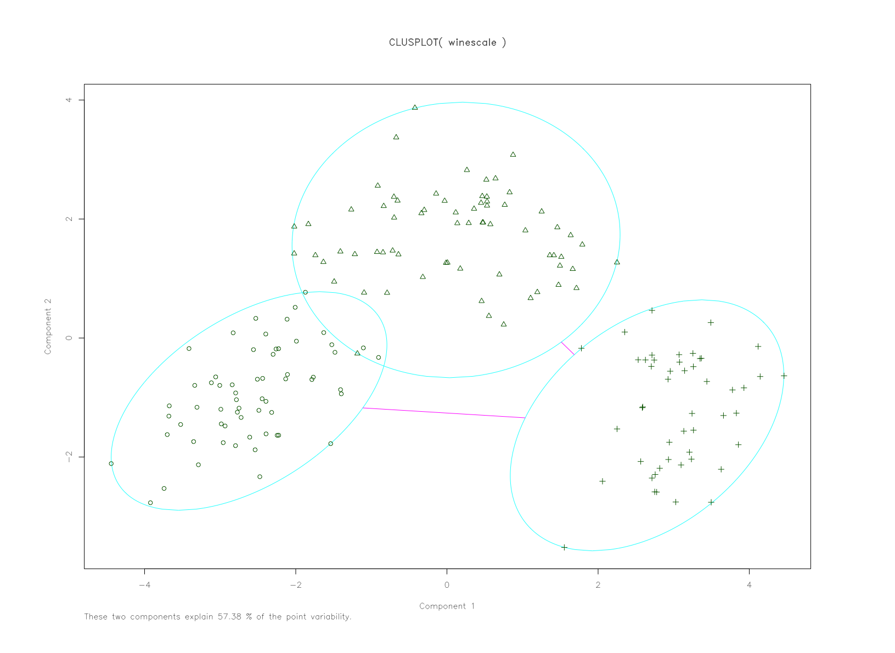
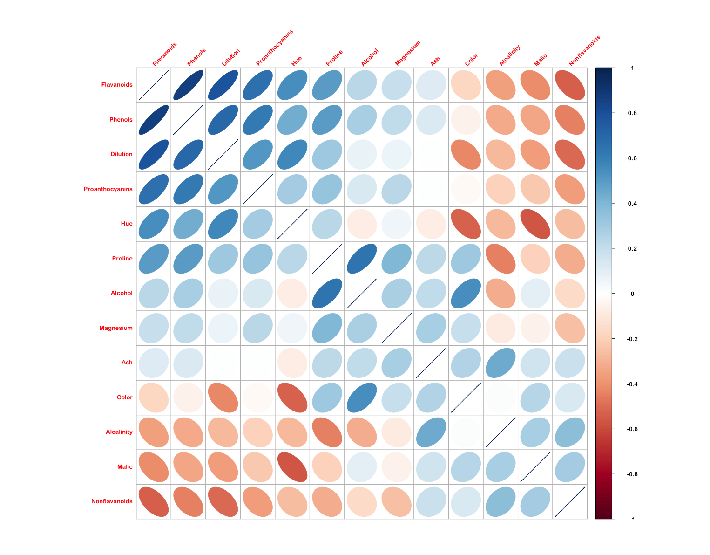

# K-means - clustering exercise

_student work in R_

This exercise is adapted from the book [R in Action](http://www.r-bloggers.com/k-means-clustering-from-r-in-action/) and takes a look at a `wine` dataset to practice two methods for doing k-means clustering.

- [Load and Scale the data](#load-and-scale)
- [Selecting a Number of Clusters: Method 01](#method-01)
- [Selecting a Number of Clusters: Method 02](#method-02)
- [K-Means Clustering](#k-means-clustering)

## Load and Scale

``` r
library(cluster)
library(rattle)
library(NbClust)

data(wine, package = "rattle")
head(wine)
```

We've got 178 rows of observations across 14 variables. A glimpse at the first 24:


First off we'll remove the first column of and then normalizing the data using `scale()`. This method takes the mean and standard deviation of each value, and then normalizes each value by 

1. substrating the mean of all values from each value.
2. dividing each value by the standard deviation of all values. 

I believe this essentially creates [z-score](http://www.r-bloggers.com/r-tutorial-series-centering-variables-and-generating-z-scores-with-the-scale-function/). 

``` r
wine$Type <- NULL
winescale <- as.data.frame(round(scale(wine), digits = 4))
```

## Selecting a Number of Clusters

### Method 01

_Looking for an elbow:_ 

"A plot of the total within-groups sums of squares against the number of clusters in a K-means solution can be helpful. A bend in the graph can suggest the appropriate amount of clusters."


**How many clusters does this method suggest?**

My initial thought is that it would suggest 3-5 clusters - but much closer to 3. It feels like 5 if I strain to see them. I'm looking at the 'joints' or 'elbows' of the plot - distinct changes in value, forming into a feature until the next 'bend' in the graph. My thinking is that clusters would form where there's an interval of points that exhibits something resembling a linear relationship - until it reaches the next 'elbow'. 

Essentially: observing a 'steep decline' in WSS (nc 1-3); a 'leveling-off'(nc 4-12, approximately); and a 'flattening out' (nc 12-15, approximately).

**Why does this method work? What is the intuition behind it?**

The _sum of squares within_ is the _distance of each sample_ from _it's groups' mean._ Group in this case is a column, with each value being a member. With the `wine` data, groups would be `Alcohol`, `Color`, `Diluation`, and such. The SSW is found by:

		0. calculate the mean of the group.
		1. find the difference between each sample and the mean of it's group.
		2. square each of these differences.
		3. take the sum of these squares.

So it's the _sum of squared differences_ between _each sample_ and _the mean of it's group._ 

The larger the value for the WSS, the larger the distance would be between each element and it's group's mean. The smaller the WSS, the closer each point would be to it's groups' mean. 

**Look at the code for wssplot() and figure out how it works.**

``` r
wssplot <- function(data, nc=15, seed=1234){
	            wss <- (nrow(data)-1)*sum(apply(data,2,var))
				for (i in 2:nc){
		        	set.seed(seed)
	                wss[i] <- sum(kmeans(data, centers=i)$withinss)}

	                plot(1:nc, wss, type="b", xlab="Number of Clusters",
	                     ylab="Within groups sum of squares",
	                     main = "Total WSS vs. Number of Clusters (15)")
	   }
```

I decided to take the function apart to really see what was going on. To distinguish between my code and the exercise code, I switched `wss` to `ssw` - [here are the details](wssplot.md).

Essentially it appears that with a set of number of clusters of 15 - 


### Method 02

This method uses the function `NbClust()` to analyze criteria, and returns a distribution of the potential number of clusters. 

``` r
library(NbClust)
set.seed(1234)
nc <- NbClust(winescale, min.nc = 2, max.nc = 15, method = "kmeans")
barplot(table(nc$Best.n[1,]),
				xlab = "Number of Clusters", ylab = "Number of Criteria",
				main = "Number of Clusters Chosen by 26 Criteria")
```

**How many clusters does this method suggest?**

This method literally suggests 3 clusters, as shown in the output and barplot:


## K-Means Clustering

#### Exercise 4 - fit K-Means model

**Once you've picked the number of clusters, run k-means using this number of clusters. Output the result of calling kmeans() into a variable fit.km.**

``` r
set.seed(24)
fit.km <- kmeans(winescale, centers = 3, iter.max = 10, nstart = 3)
```

#### Exercise 5 - evaluate K-Means model

**Using the table() function, show how the clusters in fit.km$clusters compares to the actual wine types in wine$Type. Would you consider this a good clustering?**

``` r

clustTab <- table(fit.km$cluster, wine$Type)
clustTab

#      1  2  3
#   1 59  2  0
#   2  0 68  0
#   3  0  1 48

clustDF <- as.data.frame(clustTab)

```


#### Exercise 6:

**Visualize these clusters using function clusplot() from the cluster library. Would you consider this a good clustering?**




I thought I'd try one using the `factoextra` library which has plotting arguments of `ggplot2`.

``` r
library(factoextra)
library(RColorBrewer)

clusterplot <- fviz_cluster(fit.km, winescale, repel = TRUE) +
  scale_fill_brewer(palette = "YlOrRd", direction = -1) +
  scale_color_brewer(palette = "YlOrRd", direction = -1) +
  theme_minimal(base_size = 12, base_family = "Arial Rounded MT Bold") +
  theme(plot.margin = unit(c(2, 2, 2, 2), "cm")) +
  labs(title = "K-Means - Cluster Plot")

clusterplot
```


And also try out a silhouette plot to check: 

``` r
euclideanWine <- silhouette(fit.km$cluster, d)
summary(euclideanWine)
# Silhouette of 178 units in 3 clusters
# Cluster sizes and average silhouette widths:
#       62        65        51 
#       0.3434119 0.1774106 0.3506214 

euclidWinePlot <- fviz_silhouette(euclideanWine) + 
  scale_fill_brewer(palette = "YlOrRd", direction = -1) +
  scale_color_brewer(palette = "YlOrRd", direction = -1) +
  theme_minimal(base_size = 12, base_family = "Arial Rounded MT Bold") +
  theme(axis.text.x = element_blank())

euclidWinePlot
```


And out of curiosity, I thought I'd check the correlation between individual variables in the scaled wine dataset using `corrplot`. This used the `ellipse` method and ordered the variables by first principal component.



