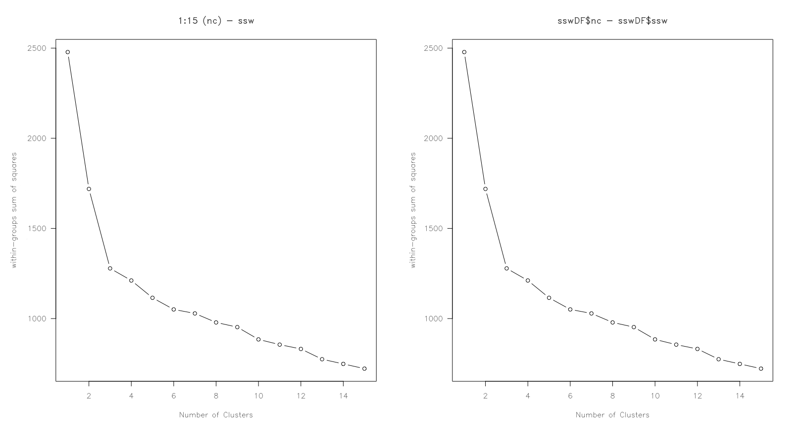

# wssplot() deconstruction

**Look at the code for wssplot() and figure out how it works.**

``` r
wssplot <- function(data, nc=15, seed=1234){
	            wss <- (nrow(data)-1)*sum(apply(data,2,var))
				for (i in 2:nc){
		        	set.seed(seed)
	                wss[i] <- sum(kmeans(data, centers=i)$withinss)}

	                plot(1:nc, wss, type="b", xlab="Number of Clusters",
	                     ylab="Within groups sum of squares",
	                     main = "Total WSS vs. Number of Clusters (15)")
	   }
```


The first part of the function appears to return the Total Sum of Squares.
``` r
ssw <- (nrow(winescale)-1)*sum(apply(winescale, 2, var)) # 2477.996
```

If we set a number of clusters to 15 for a potential K-means solution, this `for` loop returns the sum-of-squares within (each column) for each 'number of clusters' from two clusters to 15. It skips the first (nc=1) as we initialized that in the last line of code.

``` r
for (i in 2:15) {
  set.seed(123)
  ssw[i] <- sum(kmeans(winescale, centers = i)$withinss)
}
```

After running through this loop, we have values for the within-group sum-of-squares of 'i' number of clusters, from 1 to 15. 

``` r
ssw[2] # 1718.964
ssw[3] # 1278.34
ssw[4] # 1278.34
```

And to see them all:

```
sswDF <- as.data.frame(ssw = ssw, nc = 1:15)
sswDF
   	nc       ssw
1	   1 2477.9964
2	   2 1718.9638
3	   3 1278.3402
4	   4 1211.1486
5	   5 1115.2185
6	   6 1050.7021
7	   7 1028.5455
8	   8  978.5690
9	   9  952.6360
10	  10  884.4678
11	  11  855.4632
12	  12  831.5772
13	  13  774.5269
14	  14  748.4665
15	  15  722.3319
```

Just to check my own values against the function's:


